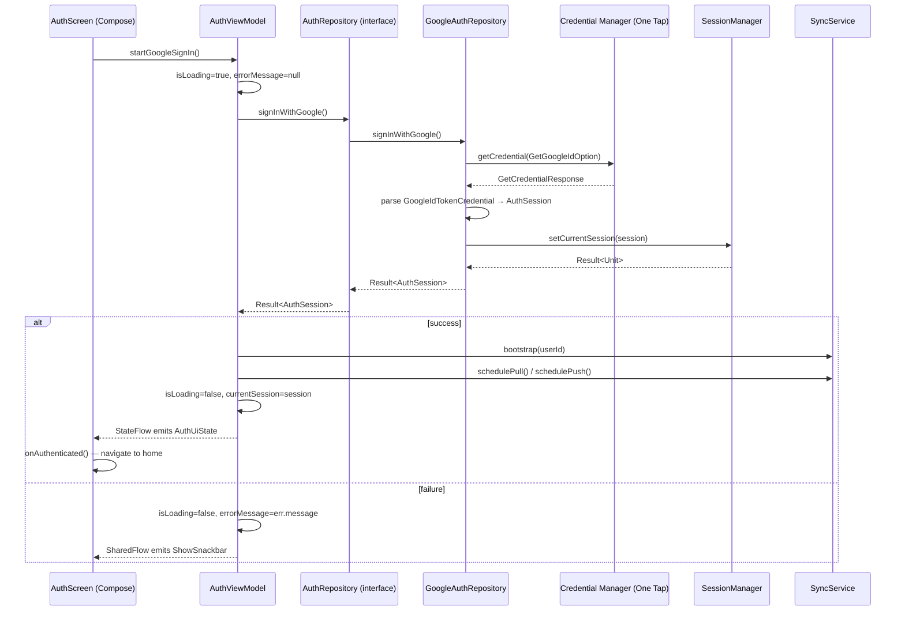
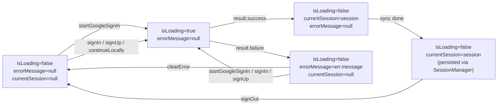

# Trace the Auth flow — Google One Tap from Compose to Sync

The Auth flow signs a user in by collecting a Google ID token via Credential Manager One Tap (the **only working path** in this build), persists the resulting `AuthSession`, and bootstraps remote sync. Six actors are involved: `AuthScreen` (Compose entry), `AuthViewModel` (state owner), `AuthRepository` (domain contract), `GoogleAuthRepository` (data impl that wraps Credential Manager), `SessionManager` (persists the session), and `SyncService` (bootstraps sync). Email/password sign-in is **intentionally disabled** — see the Auth provider note below.

## Quick path

1. Open `app/src/main/java/com/nextpage/presentation/screen/AuthScreen.kt` and find the `NextPageButton` whose `onClick` calls `viewModel.startGoogleSignIn()`. The label is `R.string.auth_continue_with_google` ("Continue with Google").
2. Open `app/src/main/java/com/nextpage/presentation/viewmodel/AuthViewModel.kt` and follow `startGoogleSignIn()` → `authRepository.signInWithGoogle()`. The VM sets `isLoading=true` and clears `errorMessage` before the call, then calls `triggerSyncForSession(session)` on success.
3. Open `app/src/main/java/com/nextpage/data/repository/GoogleAuthRepository.kt` — `signInWithGoogle()` builds a `GetCredentialRequest` with `GetGoogleIdOption`, calls `CredentialManager.getCredential(...)`, parses the `GoogleIdTokenCredential`, builds an `AuthSession`, and calls `sessionManager.setCurrentSession(session)`.
4. Back in `AuthViewModel`, the `onSuccess` branch calls `triggerSyncForSession(session)` → `syncService.bootstrap(session.userId)` then `syncService.schedulePull()` and `syncService.schedulePush()`.
5. Cross-check the Pencil design node `W29xCr` in `design/nextPage-movil.pen` to confirm the screen matches the doc.

## Details

### Call chain — Google One Tap

### UI state — `AuthUiState` flag transitions

`AuthViewModel` exposes a `StateFlow<AuthUiState>` where `AuthUiState` is a **data class** of flags — not a sealed type. The observable shape is a tuple of `(isLoading, errorMessage, currentSession, isConfigured, hasWiringIssue)`. Below are the transitions a reader can follow through the code:

#### State table — user-visible behaviour

| `isLoading` | `errorMessage` | `currentSession` | User sees |
|-------------|----------------|------------------|-----------|
| `false` | `null` | `null` | **Idle** — Google button shows "Continue with Google"; email/sign-up form collapsed behind a toggle. |
| `true` | `null` | `null` | **Loading** — Google button shows `CircularProgressIndicator` (20dp); email/sign-in/sign-up buttons disabled. |
| `true` | `null` | non-null | **Bootstrapping** — same UI as Loading; `SyncService.bootstrap` is in flight. |
| `false` | `null` | non-null | **Authenticated** — `LaunchedEffect(currentSession)` fires `onAuthenticated()`; navigates to home. |
| `false` | non-null | `null` | **Error** — error text below the form; Google button re-enabled; `clearError()` returns to Idle. |
| `false` | non-null | non-null | **Stale session + error** — error text shown; session preserved (e.g. sign-out failed). |

> `isConfigured` and `hasWiringIssue` are set once in the `init` block from build-time flags. They gate the Google button via `resolveGoogleButtonDisabledReason()` in `AuthScreen.kt` (LOADING / CONFIG_ERROR / WIRING_ERROR) and surface config-or-wiring error text above the form.

### Auth provider

Email/password sign-in is **intentionally disabled** in the current build. Both `AuthRepository.signIn(email, password)` and `AuthRepository.signUp(email, password)` are implemented in `GoogleAuthRepository.kt` to return `Result.failure(UnsupportedOperationException("Email/password auth is disabled; use Google sign-in."))`. The Compose form is still rendered (collapsed by default behind a "Sign in with email" toggle) for future re-enablement — the buttons just always surface the throwing default. **The only working sign-in path is Google One Tap.**

Two more quirks worth knowing:

- The `AuthRepository` interface ships a `signInWithGoogle` default that throws `UnsupportedOperationException("Not implemented")` (`AuthRepository.kt` line 8–10). `GoogleAuthRepository` is the only impl that overrides it. A future refactor that swaps implementations could silently break Auth.
- The legacy `startGoogleSignIn()` / `completeGoogleSignIn(callbackUri)` methods on the interface return `GOOGLE_AUTH_DEPRECATED` `AppError` — they predate One Tap and exist only for ABI stability. The `AuthViewModel.startGoogleSignIn()` function **does not** call `AuthRepository.startGoogleSignIn()`; it calls `AuthRepository.signInWithGoogle()`. The naming collision is intentional (VM-side vs repository-side) and a known wart.

## Checklist

- [ ] `AuthScreen` calls `viewModel.startGoogleSignIn()` from the Google button (`R.string.auth_continue_with_google`).
- [ ] `AuthViewModel.startGoogleSignIn()` flips `isLoading=true`, clears `errorMessage`, and calls `authRepository.signInWithGoogle()`.
- [ ] `GoogleAuthRepository.signInWithGoogle()` uses `CredentialManager` One Tap and builds `AuthSession` from `GoogleIdTokenCredential`.
- [ ] `GoogleAuthRepository` calls `sessionManager.setCurrentSession(session)` on One Tap success.
- [ ] `AuthViewModel` calls `syncService.bootstrap(userId)` then `schedulePull()` and `schedulePush()` on the success branch.
- [ ] Email/password methods exist on the interface but throw — they are not a working path.
- [ ] Pencil node `W29xCr` matches the Auth screen layout in `design/nextPage-movil.pen`.
- [ ] `AuthUiState` is a `data class` of flags, not a sealed type — no `Idle`/`Authenticated`/`Error` enums exist in code.

## Next step

After tracing Auth, open `docs/onboarding/README.md` for the first-build path. For a deeper dive into the architecture, see `docs/architecture/README.md` and the Pencil ↔ code index in `docs/design-traceability.md`.

## Design Traceability

| Code path | Pencil node | Role |
|-----------|-------------|------|
| `app/src/main/java/com/nextpage/presentation/screen/AuthScreen.kt` | `W29xCr` | Compose entry — renders the Auth form, calls `viewModel.startGoogleSignIn()` from the Google button. |
| `app/src/main/java/com/nextpage/presentation/viewmodel/AuthViewModel.kt` | `W29xCr` | State owner — exposes `StateFlow<AuthUiState>` and orchestrates One Tap sign-in + sync bootstrap. |
| `app/src/main/java/com/nextpage/domain/repository/AuthRepository.kt` | (none — domain) | Contract — pure interface in the domain layer. Default `signInWithGoogle` throws; `signIn` / `signUp` are not throwing defaults but `GoogleAuthRepository` overrides them to throw. |
| `app/src/main/java/com/nextpage/data/repository/GoogleAuthRepository.kt` | (none — data) | One Tap impl — wraps `CredentialManager`, builds `AuthSession` from `GoogleIdTokenCredential`, persists via `SessionManager`. |
| `app/src/main/java/com/nextpage/data/session/SessionManager.kt` | (none — data) | Persists the `AuthSession`; implemented by `GoogleSessionManager`. |
| `app/src/main/java/com/nextpage/data/remote/sync/SyncService.kt` | (none — data) | `bootstrap(userId)` + `schedulePull()` / `schedulePush()` after successful sign-in. |
| `app/src/main/java/com/nextpage/domain/model/AuthSession.kt` | (none — model) | Result type returned through the chain. |

> Domain and data layer rows have no Pencil node by design — the UI design does not reach them. The table is the contract: re-edit when the Pencil design changes.
