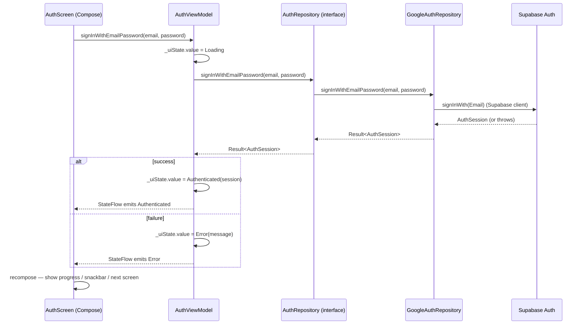
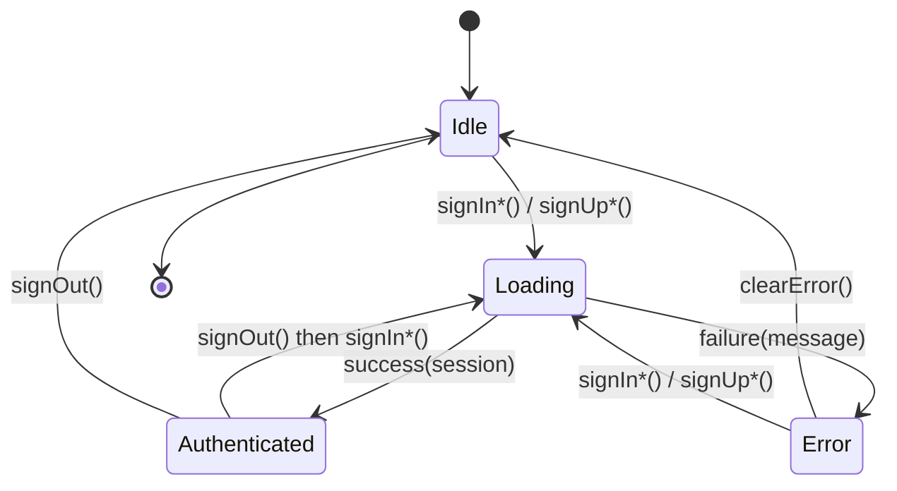

# Trace the Auth flow from Compose to Supabase

The Auth flow signs a user in (or up) by passing credentials from a Compose screen through a ViewModel and a repository, into Supabase via the Google Auth client, and finally publishes the resulting `AuthSession` back to the UI. Five actors are involved: `AuthScreen` (Compose), `AuthViewModel` (state owner), `AuthRepository` (domain contract), `GoogleAuthRepository` (Supabase impl), and `Supabase` (remote auth provider). Reading the doc top-to-bottom gives a reviewer everything they need to verify the trace in code.

## Quick path

1. Open `app/src/main/java/com/nextpage/presentation/screen/AuthScreen.kt` and find the `onSignIn` callback that dispatches into the ViewModel.
2. Open `app/src/main/java/com/nextpage/presentation/viewmodel/AuthViewModel.kt` and follow `signInWithEmailPassword` (or `signInWithGoogle`) to the call into `AuthRepository`.
3. Open `app/src/main/java/com/nextpage/data/repository/GoogleAuthRepository.kt` and confirm it implements the `AuthRepository` interface from `app/src/main/java/com/nextpage/domain/repository/AuthRepository.kt` and delegates to the Supabase auth client.
4. Build the project, run it, and tap **Sign in** — the screen should transition `Loading → Authenticated` and persist the `AuthSession`.
5. Cross-check the Pencil design node `W29xCr` in `design/nextPage-movil.pen` to confirm the screen matches the doc.

## Details

### Call chain

Sign-in call chain across five actors. The Compose screen dispatches to the ViewModel, which calls the domain repository, which is implemented by the data layer that talks to Supabase. The session flows back the same path.

### UI states

`AuthViewModel` owns a `StateFlow<AuthUiState>` with four states. The state machine covers sign-in, sign-up, error recovery, and sign-out.

#### State table

| State | Trigger to enter | User-visible behavior | Trigger to leave |
|-------|------------------|----------------------|------------------|
| `Idle` | Initial state, or after `signOut()`, or after `clearError()` | Sign-in form is enabled, no progress indicator, no error banner. | `signIn*()` / `signUp*()` → `Loading` |
| `Loading` | A sign-in / sign-up call is in flight | Progress indicator is visible; inputs disabled. | Success → `Authenticated`; failure → `Error` |
| `Authenticated` | `AuthSession` returned from Supabase | Session is held in the ViewModel; UI navigates to the home screen. | `signOut()` → `Idle` (directly or via `Loading` for re-auth). |
| `Error` | Any sign-in / sign-up call failed | Snackbar with the error message; form remains editable. | `clearError()` → `Idle`; another `signIn*()` / `signUp*()` → `Loading` |

## Checklist

- [ ] `AuthScreen` calls into `AuthViewModel` for sign-in / sign-up actions.
- [ ] `AuthViewModel` exposes a `StateFlow<AuthUiState>` consumed by `AuthScreen`.
- [ ] `AuthRepository` is the only entry point for remote auth; `GoogleAuthRepository` is its sole implementation.
- [ ] `AuthSession` is the result type and is emitted back to the ViewModel.
- [ ] Pencil node `W29xCr` matches the Auth screen layout in `design/nextPage-movil.pen`.
- [ ] `AuthUiState` covers `Idle`, `Loading`, `Authenticated`, and `Error`.

## Next step

After tracing Auth, open `docs/onboarding/README.md` to find the first-build / first-contribution path. For a deeper dive into the architecture, see `docs/architecture/README.md` and the Pencil ↔ code index in `docs/design-traceability.md`.

## Design Traceability

| Code path | Pencil node | Role |
|-----------|-------------|------|
| `app/src/main/java/com/nextpage/presentation/screen/AuthScreen.kt` | `W29xCr` | Compose entry — renders the Auth form, dispatches user actions to the ViewModel. |
| `app/src/main/java/com/nextpage/presentation/viewmodel/AuthViewModel.kt` | `W29xCr` | State owner — exposes `StateFlow<AuthUiState>` and orchestrates the sign-in call. |
| `app/src/main/java/com/nextpage/domain/repository/AuthRepository.kt` | (none — domain) | Contract — pure interface in the domain layer, no UI node. |
| `app/src/main/java/com/nextpage/data/repository/GoogleAuthRepository.kt` | (none — data) | Supabase implementation of `AuthRepository`. |
| `app/src/main/java/com/nextpage/domain/model/AuthSession.kt` | (none — model) | Result type returned to the ViewModel on success. |

> Domain and data layer rows have no Pencil node by design — the UI design does not reach them. The table is the contract: re-edit when the Pencil design changes.
