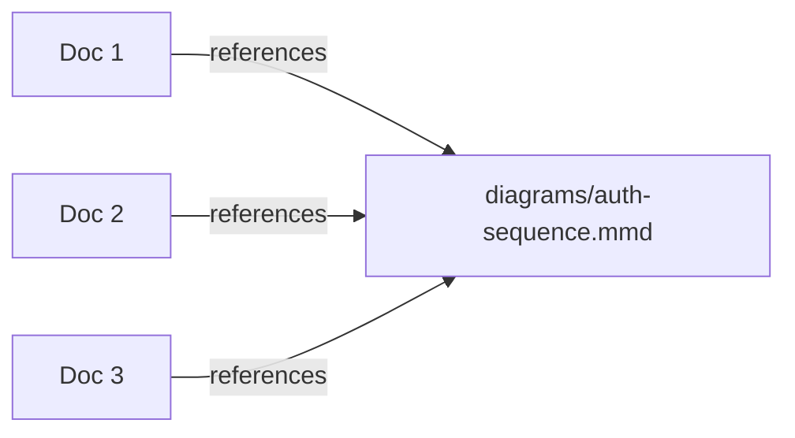

# Diagrams

The "cross-cutting" tier. This folder holds shared Mermaid sources that two or more docs reuse verbatim. Do **not** put a diagram here that is used by a single doc — keep that diagram inline in the doc that owns it.

## Purpose

Diagrams are a cross-cutting concern: the same Auth sequence diagram might be referenced by an architecture doc, a UI doc, and an onboarding doc. Promoting a diagram to a shared file in this folder means "this is the canonical source — every other doc links here, nobody copies it inline."

The default is **inline**. Promote to this folder only when you can name a second consumer that will reuse the same diagram.

## Template

A shared diagram file is a single Mermaid block plus a one-line lead-in:

Naming convention: `diagrams/<topic>-<kind>.mmd` — for example `auth-sequence.mmd` or `auth-state.mmd`. Use the matching file extension in the consumer doc's image link.

## When to put a diagram here

Promote a diagram to `diagrams/` when **all** of these hold:

- The same Mermaid source is needed in two or more docs.
- Keeping the copies in sync would be a real maintenance burden.
- The diagram is small enough that a single link target is clearer than three inline copies.

Keep the diagram inline (in the owning doc) when:

- Only one doc references it.
- The diagram is heavily contextualized — text around it changes meaning.
- You are still iterating on the shape; do not promote unstable diagrams.

## Checklist for a new shared diagram

- [ ] The same source is needed in ≥ 2 docs (name them in the file's lead-in).
- [ ] Filename follows `diagrams/<topic>-<kind>.mmd`.
- [ ] The file is a single Mermaid block plus a one-line description.
- [ ] The owning doc no longer duplicates the diagram; it links here.

## Next step

Currently empty by design. Add the first shared diagram when a second consumer appears.
